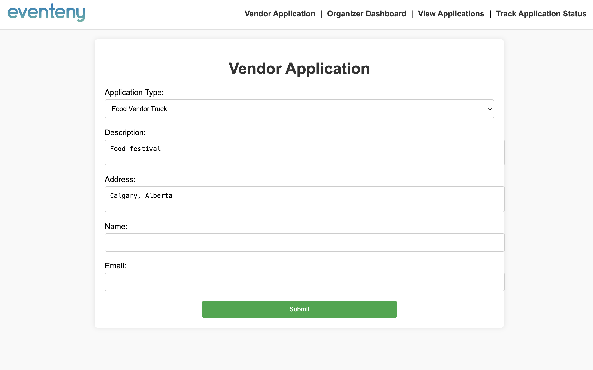

# Eventeny Application

## Overview

Eventeny application helps to create applications, manage vendor applications and expand the event management.

## Screenshots





## Features

- **Event Organizer Side**

  - Create and manage application types.
  - View applicant submissions.
  - Approve or waitlist applicants.

- **Applicant Side**
  - View application information.
  - Submit applications.
  - Track application status.

## Technologies

- Docker & Docker Compose
- PHP
- MySQL
- HTML, CSS, JavaScript

## Setup

1. **Clone the repository:**

   ```bash
   git clone https://github.com/simunde/eventeny.git
   cd eventeny
   ```

2. **Ensure Docker is installed and running on your system.**

3. **Build and start the Docker containers:**

   ```bash
   docker compose up --build
   ```

4. **Access the application:**

- Open your browser and go to http://localhost:8080

5. **To stop the application:**

```
  docker compose down
```

6. Database

- The application uses MySQL as the database. The necessary tables and initial data are set up using the init.sql file.

## Notes

- Make sure the init.sql file is correctly placed in the root directory to initialize the database correctly.
- The project is configured to use the db_data Docker volume for persistent storage of the MySQL database. If you need to reset the database, you can remove the volume using:

```
  docker volume rm eventeny_db_data

```
